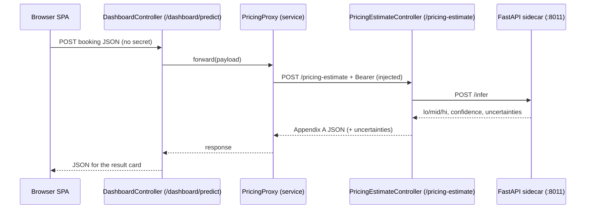

# feat: Pricing Demo Dashboard (Static SPA on Rails)

## Summary

Build a presentable single-page dashboard, served same-origin by the Rails app, with three panels — paste-JSON predict, CSV→JSON batch, and a baseline-vs-model results view. Every prediction is forwarded server-side to the real `POST /pricing-estimate` (Appendix A) with an injected bearer, so the demo exercises the actual contract while keeping the secret out of the browser. The results panel runs purely on committed artifacts (eval metrics + `predictions/predictions.csv`).

## Problem Frame

The model + API are complete but there is nothing demoable — only `curl`, pytest, and a raw CSV. The required **demo video** deliverable needs a surface to record against: a homeowner/operator pastes or uploads a booking and sees a calibrated estimate + confidence, and a results panel shows the model beating baseline. This plan builds that surface against the live API, on the existing `api_only` Rails app (`:3007`) and FastAPI sidecar (`:8011`).

## Key Decisions

- **Proxy forwards to the real endpoint (see origin: call-out 1).** A `POST /dashboard/predict` route injects `GAUNTLET_PRICING_SECRET` server-side and forwards to the app's own `/pricing-estimate`, so the demo proves the Appendix A contract, auth, and 400/401/429 behavior. The browser never holds the secret.
- **Results panel uses committed artifacts only (see origin: call-out 2).** Metrics come from a structured `reports/eval_metrics.json` (emitted by training) and per-row predictions from `predictions/predictions.csv`. No training data is read or exposed; the panel shows aggregate model-vs-baseline + per-row interval/confidence, not per-row original→corrected.
- **Serve the SPA same-origin from `api_only` Rails.** Enable static file serving and serve the SPA assets from `api/public/dashboard/`; dynamic JSON routes live in a thin `DashboardController`. Same-origin means no CORS.
- **Proxy logic lives in a service, not the controller.** A `PricingProxy` service (mirrors `SidecarClient`) does the loopback POST, keeping the controller ≤50 lines per the HouseAccount style guide (now enforced repo-wide).
- **Surface `uncertainties` on `/pricing-estimate`.** The sidecar already returns it and `SidecarClient` exposes it; add it (and `coverage`) to the controller response so the proxy can show OOD flags. Backward-compatible additive fields.
- **Vanilla JS, no build step or JS test runner.** Dependency-free SPA; charts as hand-drawn CSS bars (offline, presentable). The CSV→JSON converter is a pure function for clarity/testability even without a runner.
- **All new Ruby honors the style guide** just applied: ≤50-line files, ≤100-char lines, YARD on public surfaces, parens only when necessary, adjective-named concerns.

## High-Level Technical Design

Request flow for a single prediction (directional):



Static + data routes (no proxy): `GET /` and `/dashboard` serve the SPA; `GET /dashboard/metrics` returns `reports/eval_metrics.json`; `GET /dashboard/predictions` returns `predictions/predictions.csv` as JSON.

## Output Structure

```
api/
  app/controllers/dashboard_controller.rb        # thin: index, predict, metrics, predictions
  app/services/pricing_proxy.rb                  # loopback POST to /pricing-estimate
  public/dashboard/
    index.html                                   # SPA shell + 3 panels
    app.js                                        # logic: predict, CSV→JSON batch, results
    styles.css                                    # presentable styling
  spec/requests/dashboard_spec.rb                # request specs for the 3 dynamic routes
reports/eval_metrics.json                        # NEW structured metrics (emitted by training)
```

---

## Implementation Units

### U1. Surface `uncertainties` + `coverage` on `/pricing-estimate`
- **Goal:** add the sidecar's `uncertainties` (and `coverage`) to the Appendix A success response so the dashboard can show OOD flags. Backward-compatible.
- **Requirements:** origin R4 (show OOD flags), R2.
- **Dependencies:** none.
- **Files:** `api/app/controllers/pricing_estimate_controller.rb`, `api/spec/requests/pricing_estimate_spec.rb`.
- **Approach:** `SidecarClient.infer` already returns `:uncertainties` and `:coverage`; add both keys to the `create` render hash. Keep the file ≤50 lines (it's at 26 — fine). Do not change existing keys.
- **Patterns to follow:** the existing `create` render hash; existing spec stub style (`sidecar_response`).
- **Test scenarios:**
  - Happy path: sidecar returns `uncertainties: "..."` and `coverage: 0.83` → response body includes both fields. Covers R4.
  - Backward-compat: when sidecar omits them, response still 200 and the keys are `null`/absent without error.
  - Existing 23 examples still green (no key removed/renamed).
- **Verification:** `bundle exec rspec` green; a sample prediction shows the uncertainties string.

### U2. Emit structured `reports/eval_metrics.json` from training
- **Goal:** write a small, clean metrics JSON alongside `eval_report.md` so the dashboard reads structured data instead of parsing markdown.
- **Requirements:** origin R10, R12 (committed OOF metrics).
- **Dependencies:** none.
- **Files:** `src/houseprice/train.py`, `tests/test_model_eval.py` (or a new assertion), `reports/eval_metrics.json` (generated).
- **Approach:** in `train.py::main`, after computing `blended`, `real`, `base_blended`, `base_real`, `cov`, dump a JSON object (`{model_version, blended, real_only, coverage, baseline_blended, baseline_real, n_real, generated_for}`) next to the report. Round sensibly. Commit the generated file (it's a non-sensitive aggregate, like `eval_report.md`).
- **Patterns to follow:** how `train.py` writes `REPORT_PATH`; rounding used in `predictions.csv`.
- **Test scenarios:**
  - After `main()` runs, `reports/eval_metrics.json` exists and parses, with `blended < baseline_blended` and `real_only < baseline_real`.
  - Keys present and numeric: `blended`, `real_only`, `coverage`, baselines.
- **Verification:** run `PYTHONPATH=src python3 -m houseprice.train deterministic`; the JSON matches the report table values.

### U3. Static SPA serving shim
- **Goal:** serve the SPA same-origin from the `api_only` app.
- **Requirements:** origin R1.
- **Dependencies:** none.
- **Files:** `api/config/routes.rb`, `api/config/environments/development.rb` (and `production.rb` if needed), `api/app/controllers/dashboard_controller.rb` (the `index` action), `api/public/dashboard/` (placeholder).
- **Approach:** enable static file serving (set `config.public_file_server.enabled = true` in development, or `RAILS_SERVE_STATIC_FILES`); add routes `get "/" => "dashboard#index"` and `get "/dashboard" => "dashboard#index"`. `index` serves the SPA via `send_file` of `public/dashboard/index.html` (works under `api_only`, no views). Keep the controller ≤50 lines.
- **Patterns to follow:** existing `routes.rb` `match` style; `api_only` constraints.
- **Test scenarios:**
  - `GET /` returns 200 and HTML content-type (the SPA shell).
  - `GET /dashboard` returns the same shell.
  - JS/CSS assets under `public/dashboard/` are reachable.
- **Verification:** visiting `http://127.0.0.1:3007/` renders the shell.

### U4. Dashboard backend routes — proxy, metrics, predictions
- **Goal:** the three dynamic JSON routes the SPA calls.
- **Requirements:** origin R2, R3, R8, R10, R11, R12.
- **Dependencies:** U1 (uncertainties), U2 (metrics json), U3 (controller exists).
- **Files:** `api/app/controllers/dashboard_controller.rb`, `api/app/services/pricing_proxy.rb`, `api/config/routes.rb`, `api/spec/requests/dashboard_spec.rb`.
- **Approach:**
  - `POST /dashboard/predict`: read JSON body, call `PricingProxy.forward(payload)` → returns the `/pricing-estimate` response. `PricingProxy` does a `Net::HTTP` POST to `<base>/pricing-estimate` with `Authorization: Bearer ENV["GAUNTLET_PRICING_SECRET"]`; base from `request.base_url` (or `DASHBOARD_API_URL`). Pass through the upstream status + body (so 400/401/429/500 surface to the SPA).
  - `GET /dashboard/metrics`: read and return `reports/eval_metrics.json`.
  - `GET /dashboard/predictions`: read `predictions/predictions.csv`, return as JSON array (cap rows if large).
  - Dev-only guard on `/dashboard/*` proxy (e.g., skip in production or require same-origin) — documented as a demo-only convenience.
  - Keep `DashboardController` ≤50 lines (extract proxy into `PricingProxy`); `PricingProxy` ≤50 lines mirroring `SidecarClient`.
- **Patterns to follow:** `app/services/sidecar_client.rb` (service shape, error rescue, timeouts); `pricing_estimate_controller.rb` (thin controller).
- **Execution note:** Start with a failing request spec for `POST /dashboard/predict` forwarding (stub the loopback `/pricing-estimate` with WebMock).
- **Test scenarios:**
  - `POST /dashboard/predict` with a valid booking → 200 and the Appendix A body (lo/mid/hi/confidence/uncertainties). Covers R2.
  - Proxy injects the bearer: the forwarded request carries `Authorization: Bearer <secret>` (assert via WebMock). Covers R3.
  - Upstream 400 (missing field) / 401 / 429 are passed through with the same status + body to the SPA. Covers R2.
  - No secret in any client-delivered asset (assert the served `index.html`/`app.js` contain no secret). Covers R3 / AE2.
  - `GET /dashboard/metrics` returns the parsed metrics JSON; `GET /dashboard/predictions` returns an array of rows with `estimate_midpoint`/`confidence`.
  - `GET /dashboard/predictions` when the CSV is absent → graceful empty/`503`-style JSON, not a crash.
- **Verification:** `bundle exec rspec` green; the SPA's predict call returns a real estimate; a `curl` to `/pricing-estimate` with the same payload matches (AE4).

### U5. SPA shell + Predict panel
- **Goal:** the page shell (header, status dot, tabs) and the single-prediction panel.
- **Requirements:** origin R4, R5, R6, R13; flow F1; AE1.
- **Dependencies:** U3, U4.
- **Files:** `api/public/dashboard/index.html`, `api/public/dashboard/app.js`, `api/public/dashboard/styles.css`.
- **Approach:** vanilla JS. JSON textarea + "Load sample" prefill + Predict button → `POST /dashboard/predict`; render the result card (interval bar low→mid→hi, confidence meter, uncertainties list); low-confidence (<0.5) amber banner; errors render inline (malformed JSON) or as a toast (401/429/500). Header shows API status dot + model version. Follow the design brief (`docs/design/2026-05-31-dashboard-design-brief.md`) for layout/states.
- **Patterns to follow:** the design brief's component kit + state matrix.
- **Test scenarios (manual/smoke — no JS runner per Key Decisions):**
  - Load sample → Predict → result card shows lo/mid/hi + confidence% + uncertainties.
  - Malformed JSON in the textarea → inline parse error, no request fired. Covers AE1.
  - Force a 401 (bad/empty secret server-side) → error toast with the API message.
  - A >$5k booking → low-confidence amber banner + OOD flag visible.
- **Verification:** the three states render correctly in a browser against the running stack.

### U6. Batch panel (CSV → JSON → scored table)
- **Goal:** CSV upload, visible JSON conversion, concurrency-capped batch scoring, results table with row drawer.
- **Requirements:** origin R7, R8, R9; flow F2; AE3.
- **Dependencies:** U4, U5.
- **Files:** `api/public/dashboard/app.js`, `api/public/dashboard/index.html`, `api/public/dashboard/styles.css`.
- **Approach:** a pure `csvToBookings(text)` function (header-mapped to Appendix A fields) — kept pure for clarity/testability. Show the converted JSON array; "Run batch" loops `POST /dashboard/predict` with a concurrency cap (e.g. 4) and a progress indicator; render a results table (inputs → lo/mid/hi/confidence); rows failing validation get a warning chip and don't abort the batch; clicking a row opens the detail drawer.
- **Patterns to follow:** design brief Batch view + overlay inventory (drawer).
- **Test scenarios (manual/smoke):**
  - A 20-row CSV with 1 malformed row → 19 scored, 1 flagged, batch completes. Covers AE3.
  - Concurrency cap respected (not all requests fire at once).
  - Converted-JSON preview matches the uploaded CSV rows.
  - Row click → drawer shows full prediction + uncertainties.
- **Verification:** batch of a sample CSV renders a complete table with one flagged row.

### U7. Results / metrics panel
- **Goal:** the "see changes" view — model-vs-baseline metrics + per-row predictions.
- **Requirements:** origin R10, R11, R12; flow F3.
- **Dependencies:** U2, U4.
- **Files:** `api/public/dashboard/app.js`, `api/public/dashboard/index.html`, `api/public/dashboard/styles.css`.
- **Approach:** on load, fetch `/dashboard/metrics` → stat-cards (blended MAPE, real-only MAPE, coverage) each with pass/fail vs baseline + delta; a comparison view (hand-drawn CSS bars: model vs baseline); fetch `/dashboard/predictions` → a table/scatter of predicted intervals with confidence encoded. Caption: "leakage-free out-of-fold." Graceful "metrics unavailable" state when the JSON/CSV is missing.
- **Patterns to follow:** design brief Results view + stat-card component.
- **Test scenarios (manual/smoke):**
  - Loaded: stat-cards show 10.5%/26.2%/83% with green pass checks vs baseline.
  - Metrics endpoint unavailable → "metrics not generated yet" message, no crash.
  - Predictions table renders rows with confidence encoded.
- **Verification:** the panel reproduces the `eval_report.md` numbers against baseline.

---

## Scope Boundaries

**In scope:** the three panels, same-origin serving, the forward-proxy + data routes, the `uncertainties` passthrough, and the structured metrics JSON.

### Deferred to Follow-Up Work
- Railway (or remote) deployment of the dashboard.
- A real server-side batch prediction endpoint (batch loops client-side for now).
- Export/download of scored results; persistence/history.
- Per-row original→corrected view (would require reading the local dataset — explicitly deferred per origin call-out 2).

**Outside this product's identity:** user accounts/auth UI, multi-tenant isolation, editing the model/data from the UI, live retraining, mobile-first layouts.

---

## Risks & Dependencies

- **Static serving under `api_only`:** `ActionDispatch::Static` is off by default; U3 must enable it (or `send_file`) — verified approach, but the exact toggle is the first thing to confirm at execution.
- **Loopback proxy base URL:** `request.base_url` should resolve to the same host:port; if reverse-proxied, fall back to `DASHBOARD_API_URL`. Low risk locally.
- **Style-guide drift:** new Ruby (`DashboardController`, `PricingProxy`) must stay ≤50 lines — the reason proxy logic is a separate service. Re-run the style check after U4.
- **Demo dependency:** all three services must be running (`train.py` to produce artifacts, sidecar, Rails). Documented in the deployment guide.

## Sources & Research

- Origin requirements: `docs/brainstorms/2026-05-31-pricing-demo-dashboard-requirements.md`.
- Design brief (layout/states/components): `docs/design/2026-05-31-dashboard-design-brief.md`.
- API contract + auth + errors: `assignment_description.md` (Appendix A); `api/app/controllers/pricing_estimate_controller.rb` (+ `concerns/authenticated.rb`, `concerns/validated.rb`, `concerns/throttled.rb`).
- Service pattern to mirror: `api/app/services/sidecar_client.rb`. Metrics/predictions sources: `src/houseprice/train.py`, `reports/eval_report.md`, `predictions/predictions.csv`.
- Test pattern: `api/spec/requests/pricing_estimate_spec.rb` (WebMock-stubbed request specs).
